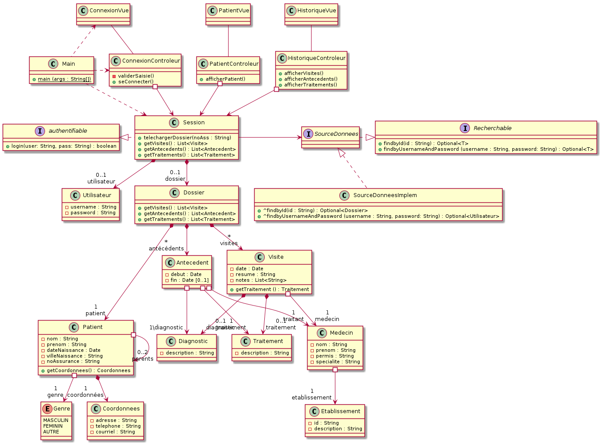

# Rapport de conception détaillée du système dossier médical centralisé

## présenté à Dogny Gnagnely Serge  et Faidi Sofiane

 

 

## Composition de l'équipe : 

**Fethi bey Abi ayad :**

 *Code permanent :* ABIF10108204

 *adresse courriel :* abi_ayad.fethi_bey@courrier.uqam.ca 

**Hamza Yahi :**

 *Code permanent :*  YAHH07019802  

 *adresse courriel :* af491086@ens.uqam.ca
 
 **Mohamed Hocine Rehouma :**

 *Code permanent :* 

 *adresse courriel :* 

 

## Table des matières
- [Diagramme des usecases](#id-section1)

- [Diagramme de classe](#id-section2)

    - [Diagramme de classe de l'application du medecin](#id-section3)    
    - [Diagramme de classe de l'application du professionnel](#id-section4)    
    - [Diagramme de classe de l'application de l'assuré ](#id-section5)    
    - [Diagramme de classe de l'application de la RAMQ ](#id-section6)   

- [Diagramme de séquence](#id-section7)

    - [S'authentifier](#id-section8)    
    - [Télécharger dossier](#id-section9)    
    - [Consulter l'historique des visites](#id-section10)   
    - [Consulter l'historique des traitements](#id-section11)   
    - [Consulter les antécédents](#id-section12)   
    - [Consulter les coordonnées](#id-section13)   
    - [Ajouter une nouvelle visite](#id-section14)   
    - [Ajouter un nouvel antécédent](#id-section15) 
    - [Modifier les coordonnées ](#id-section16) 
    - [Annuler les modifications ](#id-section17) 
    - [Enregistrer le dossier ](#id-section18) 
    - [Reconstruire le dossier par date](#id-section19) 
    - [Reconstruire le dossier par modification](#id-section20) 

- [Diagramme de packages](#id-section21)

- [Diagramme de composants](#id-section22)

- [Diagramme de déploiement de système](#id-section23)

## Diagramme des usecases

## Diagrammes de classe

### Diagramme de classe De l'application du medecin

### Diagramme de classe De l'application du professionnel

### Diagramme de classe De l'application de l'assuré (application web et mobile) 

### Diagramme de classe De l'application de la RAMQ

## Diagrammes de séquence 

### Diagramme de séquence : S'authentifier

### Diagramme de séquence : Télécharger dossier

### Diagramme de séquence : Consulter l'historique des visites

### Diagramme de séquence : Consulter l'historique des traitements

### Diagramme de séquence : Consulter les antécédents

### Diagramme de séquence : Consulter les coordonnées

### Diagramme de séquence : Ajouter une nouvelle visite

### Diagramme de séquence : Ajouter un nouvel antécédent

### Diagramme de séquence : modifier les coordonnées

### Diagramme de séquence : Annuler les modifications

### Diagramme de séquence : Enregistrer le dossier

### Diagramme de séquence : Reconstruire le dossier par date

### Diagramme de séquence : Reconstruire le dossier par modification

## Diagramme de packages

## Diagramme de composants

## Diagramme de déploiement du système

