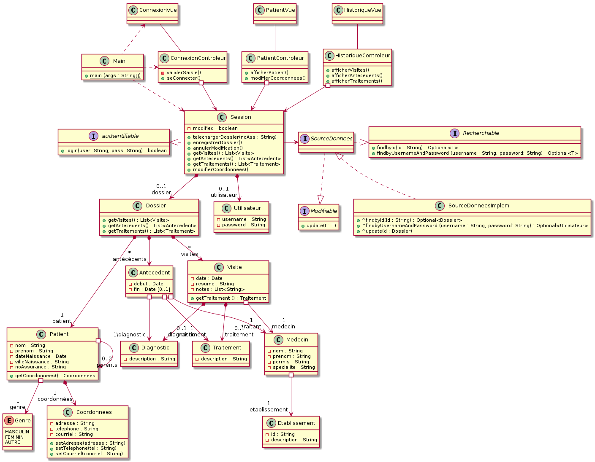
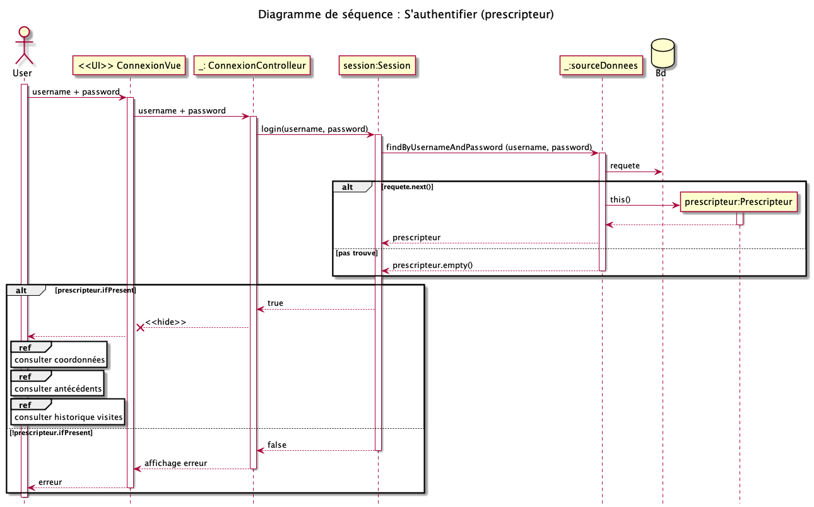
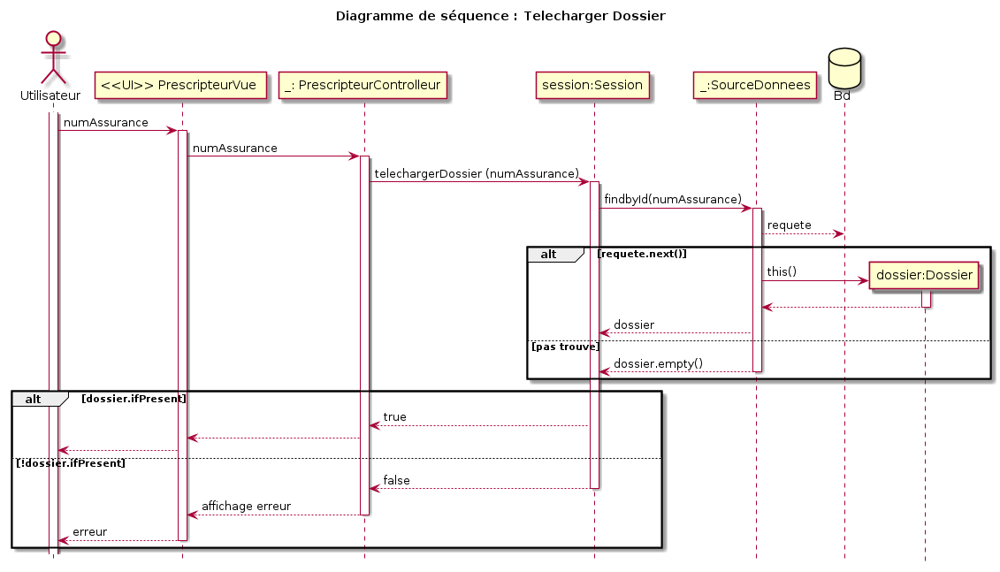
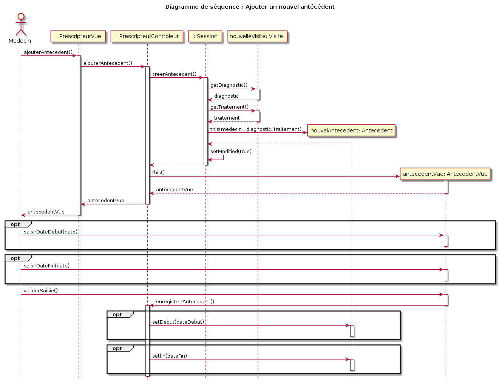
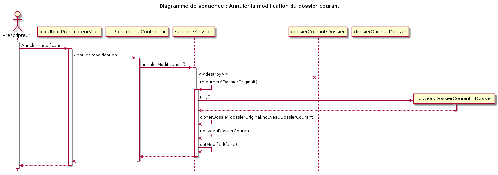
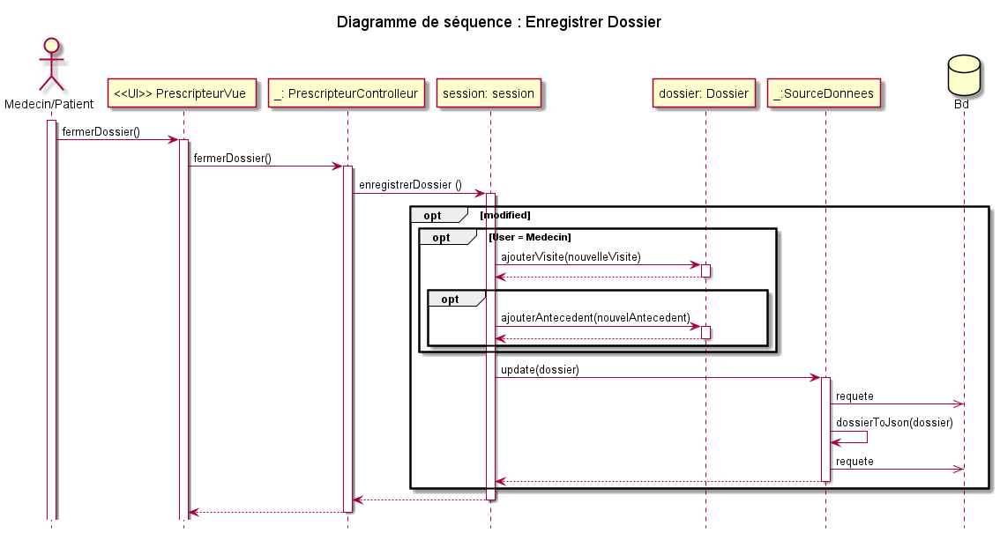
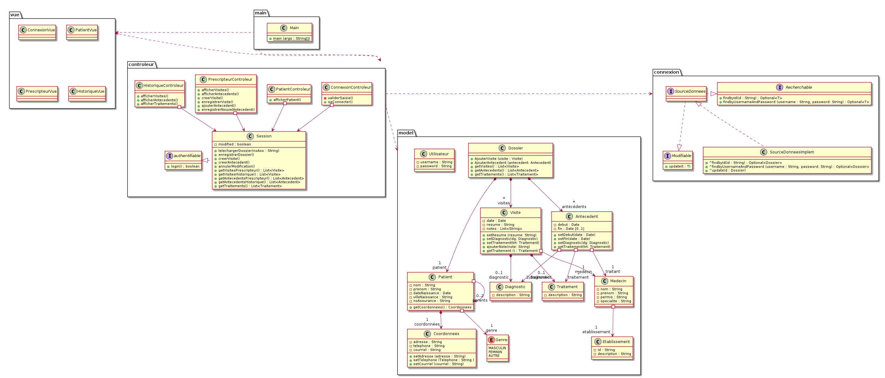
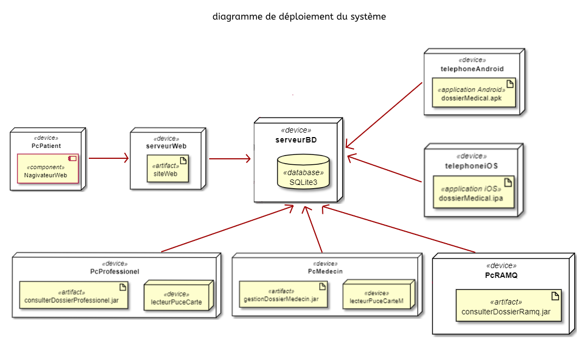

# Rapport de conception détaillée du système dossier médical centralisé

## présenté à Dogny Gnagnely Serge  et Faidi Sofiane

 

 

## Composition de l'équipe : 

**Fethi bey Abi ayad :**

 *Code permanent :* ABIF10108204

 *adresse courriel :* abi_ayad.fethi_bey@courrier.uqam.ca 

**Hamza Yahi :**

 *Code permanent :*  YAHH07019802  

 *adresse courriel :* af491086@ens.uqam.ca
 
 **Mohamed Hocine Rehouma :**

 *Code permanent :* rehm23029604

 *adresse courriel :* ck191923@ens.uqam.ca

 

## Table des matières
- [Diagramme des usecases](#id-section1)

- [Diagramme de classe](#id-section2)

    - [Diagramme de classe de l'application du medecin](#id-section3)    
    - [Diagramme de classe de l'application du professionnel](#id-section4)    
    - [Diagramme de classe de l'application de l'assuré ](#id-section5)    
    - [Diagramme de classe de l'application de la RAMQ ](#id-section6)   

- [Diagramme de séquence](#id-section7)

    - [S'authentifier](#id-section8)    
    - [Télécharger dossier](#id-section9)    
    - [Consulter l'historique des visites](#id-section10)   
    - [Consulter l'historique des traitements](#id-section11)   
    - [Consulter les antécédents](#id-section12)   
    - [Consulter les coordonnées](#id-section13)   
    - [Ajouter une nouvelle visite](#id-section14)   
    - [Ajouter un nouvel antécédent](#id-section15) 
    - [Modifier un antécédent](#id-section151) 
    - [Modifier les coordonnées ](#id-section16) 
    - [Annuler les modifications ](#id-section17) 
    - [Enregistrer le dossier ](#id-section18) 
    - [Reconstruire le dossier par date](#id-section19) 
    - [Reconstruire le dossier par modification](#id-section20) 

- [Diagramme de packages](#id-section21)

- [Diagramme de composants](#id-section22)

- [Diagramme de déploiement de système](#id-section23)

- [Justification des responsabilités des classes](#id-section24)

## Diagramme des usecases

## Diagrammes de classe

Les types d'acteurs qui intéragissent avec le système du dossier médical centralisé se distinguent en 4 catégories :

- Le médecin qui peut consulter et modifier le dossier du patient
- Le professionnel de la santé autre que le médecin qui ne peut que consulter le dossier du patient
- L'assuré qui peut consulter son propre dossier médical avec la possibilité de modification des coordonnées
- Le système RAMQ qui est responsable de la création des dossiers des nouvaux assurés avec la possibilité de reconstruction d'un dossier à une date précise

De ce fait, on modélise un diagramme de classe pour chaque type d'acteur utilisant une application spécifique à son besoin.

### Diagramme de classe De l'application du medecin

La modélisation de l'application utilisée par le médecin se distingue par la présence des classes PrescripteurVue et PrescripteurControleur.

Ces deux classes permettent à l'utilisateur de modifier certaines données tel que l'ajout d'une nouvelle visite, l'ajout d'un nouvel antécédent et la modification d'un ancien antécédent lié au medecin utilisateur

### Diagramme de classe De l'application du professionnel

La modélisation de l'application utilisée par le professionnel de santé autre qu'un médecin se distingue par l'absence des classes PrescripteurVue et PrescripteurControleur.

L'utilisateur ne pourra modifier aucune information sur le dossier, mais peut les consulter en lecture seule à travers la classe HistoriqueVue. 

### Diagramme de classe De l'application de l'assuré (application web et mobile) 

La modélisation de l'application utilisée par l'assuré se distingue aussi par l'absence des classes PrescripteurVue et PrescripteurControleur mais avec une différence pour la classe PatientControleur qui permet à l'utilisateur de modifier ses coordonnées.

### Diagramme de classe De l'application de la RAMQ

## Diagrammes de séquence 

### Diagramme de séquence : S'authentifier

### Diagramme de séquence : Télécharger dossier

### Diagramme de séquence : Consulter l'historique des visites

Ce cas d'utilisation est déclenché par le chargement du dossier. le résultat obtenu est l'affichage de la liste de l'historique des visites dans la vue Historique. 

### Diagramme de séquence : Consulter l'historique des traitements

Ce cas d'utilisation est déclenché par le chargement du dossier. le résultat obtenu est l'affichage de la liste des traitements du patient dans la vue Historique. 

git 
### Diagramme de séquence : Consulter les coordonnées

Ce cas d'utilisation est déclenché par le chargement du dossier. le résultat obtenu est l'affichage des coordonnées du patient dans la vue Patient.

### Diagramme de séquence : Ajouter une nouvelle visite

Ce cas d'utilisation est déclenché par le médecin sur la vue Prescripteur. le résultat obtenu est l'ajout d'un nouveau objet visite au dossier.

### Diagramme de séquence : Ajouter un nouvel antécédent

Ce cas d'utilisation est déclenché par le médecin sur la vue Prescripteur. le résultat obtenu est l'ajout d'un nouveau objet antecedent au dossier.

### Diagramme de séquence : Modifier antécédent

Ce cas d'utilisation est déclenché par le médecin sur la vue Prescripteur sur une ligne d'un ancien antécédent. L'entécédent doit être enregistré auparavant par le même médecin utilisateur. Le résultat obtenu est la modification de l'ancien antecedent au dossier.

### Diagramme de séquence : modifier les coordonnées

### Diagramme de séquence : Annuler les modifications

### Diagramme de séquence : Enregistrer le dossier

Ce cas d'utilisation est déclenché par le médecin sur la vue Prescripteur . En cas de modification de dossier, le résultat obtenu est la mise à jour du dossier sur la base de données distante avec une création d'une nouvelle ligne sur la table archive incluant un objet json contenant toutes les information de l'objet dossier et correspondant à la date du mise à jour et le numéro d'assurance du patient.

### Diagramme de séquence : Reconstruire le dossier par date

### Diagramme de séquence : Reconstruire le dossier par modification

### Diagramme de séquence : Création d'un dossier

## Diagramme de packages

On peut séparer les classes de notre application en cinq packages différents :

- Le package `main` : ne contient que la classe Main qui est le point d'entrée de l'application.
- Le  package `vue` : contient toutes les classes générant la vue affichée à l'utilisateur.
- Le package `controleur` : contient toutes les classes de responsabilité de contrôl.
- Le package `model` : contient les classes constituants les entités de notre application.
- Le package `connexion` : contient les classes responsable de la communication avec l'environnement extérne à notre applicattion par des requettes Http ou SQL

## Diagramme de composants

## Diagramme de déploiement du système

## Justification des responsabilités des classes selon le pattern GRASP

- **La classes ConnexionControleur** : a la responsabilité de contrôleur qui gère la connexion de l'utilisateur en récupérant les données saisies de la classe ConnexionVue, les valident avec la méthode privée validerSaisie() puis délègue la connexion à la classe Session via la méthode publique login().

- **La classe PrescripteurControleur** : présente que dans l'application du médecin a la responsabilité de contrôleur qui gère : 
    - L'affichage des visites du médecin connecté via la méthode afficherVisites() qui récupère les données via la méthode publique getVisitesPrescripteur() de la classe Session.
    - L'affichage des antécédents du médecin connecté via la méthode afficherAntecedents() qui récupère les données via la méthode publique getAntecedentsPrescripteur() de la classe Session.
    - L'ajout d'une nouvelle visite via la méthode creerVisites() et enregistrerVisite() qui délègue la création de l'objet Visite à la classe Session via sa méthode publique creerVisite().
    - L'ajout d'un nouvel antécédent via la méthode ajouterAntecedent() et enregistrerEntecedent()qui délègue la création de l'objet Antecedent à la classe Session via sa méthode publique creerAntecedent().

- **La classe HistoriqueControleur** : a la responsabilité de contrôleur qui gère : 
    - L'affichage des visites des médecins autres que le médecin connecté via la méthode afficherVisites() qui récupère les données via la méthode publique getVisitesHistorique() de la classe Session.
    - L'affichage des antécédents des médecins autres que le médecin connecté via la méthode afficherAntecedents() qui récupère les données via la méthode publique getAntecedentsHistorique() de la classe Session.
   - L'affichage des traitements du patient via la méthode afficherTraitements() qui récupère les données via la méthode publique getTraitements() de la classe Session.

- **La classe PatientControleur** : a la responsabilité de contrôleur qui gère : 
   - L'affichage des coordonnées du patient via la méthode afficherPatient() qui récupère les données via la méthode publique getPatient() de la classe Session.
   - La modification des coordonnées du patient (Application de l'assuré) via la méthode modifierCoordonnees() qui délègue cette opération à la classe Session via sa métode publique modifierCoordonnees()

- **La classe Session :**

    + **telechargerDossier(noAss : String)** 
        Controleur : la classe Session a la responsabilité de gérer le chargement de l'objet Dossier en déléguant cette opération à la classe SourceDonnees via la méthode publique findbyId(id: String).

    + **enregistrerDossier()** 
        Controleur, spécialiste de l'information : la classe Session a la responsabilité de gérer la sauvegarde de l'objet Dossier car elle a l'information de cet objet à sauvegarder, en déléguant cette opération à la classe SourceDonnees via la méthode publique update(d: Dossier).

    + **creerVisite()** 
        Créateur, spécialiste de l'information : la classe Session a la responsabilité de créer un objet Visite en tant que nouvelle visite, et cette information résidera au niveau de la classe Session.
    
    + **creerAntecedent()** 
        Créateur, spécialiste de l'information : la classe Session a la responsabilité de créer un objet Antecedent en tant que nouvel antécédent, et cette information résidera au niveau de la classe Session.
    
    + **annulerModification()**  
        spécialiste de l'information : la classe Session peut annuler toutes les modifications aportées au dossier car elle détient toute l'information concernant le dossier ouvert ainsi que la nouvelle visite ou le nouvel antécédent créés.
    
    + **getVisitesPrescripteur() : List\<Visite>** / **getVisitesHistorique() : List\<Visite>**  
        spécialiste de l'information : la classe Session récupère la liste des objets Visite de la classs Dossier via la méthode publique getVisites() puis filtre cette liste selon l'objet Medecin (le médecin connecté). La classe Session détient l'information du dossier et du médecin connecté.

    + **getAntecedentsPrescripteur() : List\<Antecedent>** / **getAntecedentsHistorique() : List\<Antecedent>**  
        spécialiste de l'information : la classe Session récupère la liste des objets Antecedent de la classs Dossier via la méthode publique getAntecedents() puis filtre cette liste selon l'objet Medecin (le médecin connecté). La classe Session détient l'information du dossier et du médecin connecté.
    
    + **getTraitements() : List\<Traitement>**  
        spécialiste de l'information : la classe Session récupère la liste des objets Traitement de la classs Dossier via la méthode publique getTraitements() car elle détient l'information de l'objet Dossier.
    
    + **login(user: String, pass: String) : boolean**  
        Controleur : la classe Session implémente l'interface Authentifiable qui est responsable de la gestion de la connexion de l'utilisateur en déléguant cette opération à la classe SourceDonnees via la méthode publique findbyUsernameAndPassword().

- **La classe SourceDonneesImplem :**

    + **update(d : Dossier)** 
        Controleur , spécialiste de l'information: L'interface SourceDonnees implémente l'interface Modifiable qui a la responsabilité de gérer la mise à jour des données du dossier sur la base de données distante car elle détient l'information de connexion et de communication avec cette base de données.

    + **findbyUsernameAndPassword (username : String, password: String) : Optional\<Utilisateur>** 
        Créateur , spécialiste de l'information: L'interface SourceDonnees implémente l'interface Recherchable qui a la responsabilité de créer l'objet Utilisateur à partir la base de données distante car elle détient l'information de connexion et de communication avec cette base de données.

    + **findbyId(id : String) : Optional\<Dossier>** 
        Créateur , spécialiste de l'information: L'interface SourceDonnees implémente l'interface Recherchable qui a la responsabilité de créer l'objet Dossier à partir la base de données distante car elle détient l'information de connexion et de communication avec cette base de données.
